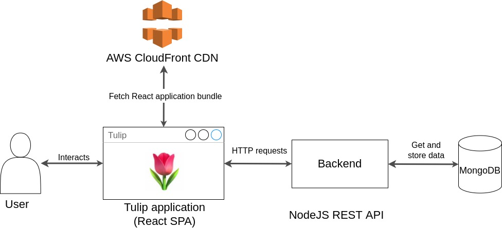
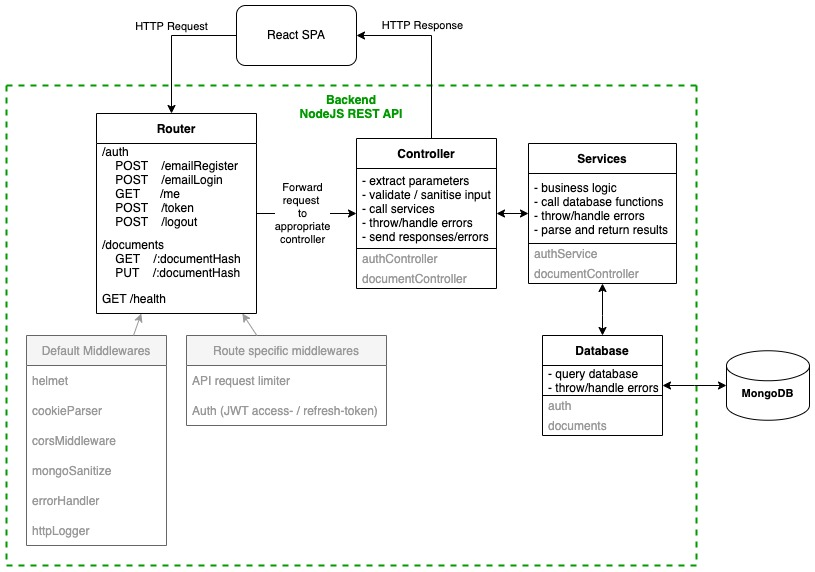
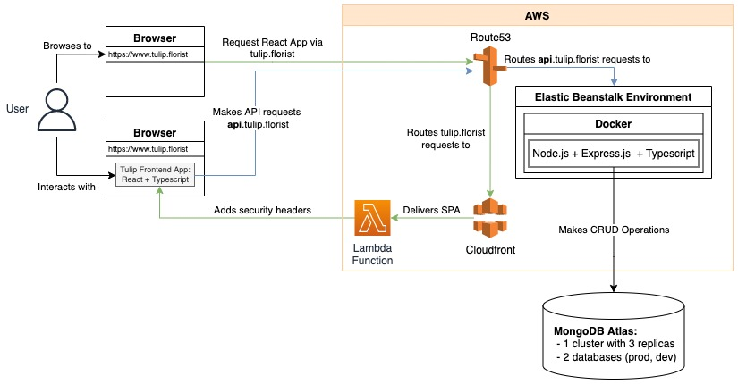
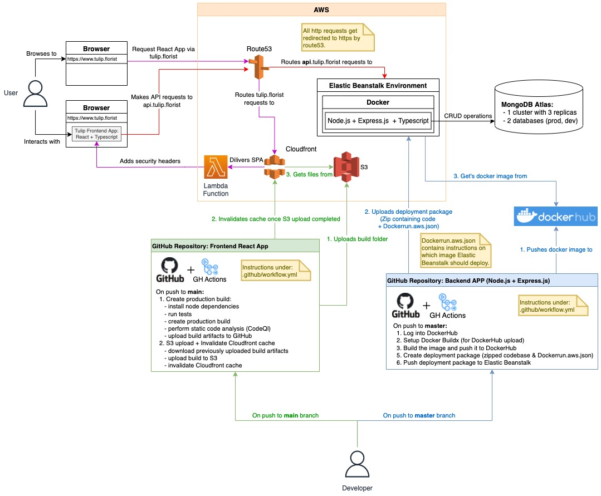

# Tulip Backend

> Backend for [Tulip](https://github.com/tulip-florist/tulip) open source document reader

## Development setup

Local development setup for the Tulip (backend) application.

Clone the repository

Install the dependencies

    npm install

Create a `.env` file with the following variables to connect to mongoDb Atlas and setup JWT auth.

```
PORT=8080
DB_USERNAME=<mongoDb_user_name>
DB_PASSWORD=<mongoDb_user_password>
DB_NAME=<mongoDb_db_name>
JWT_SECRET=<your_custom_jwt_secret>
LOG_LEVEL_FILE=info
LOG_LEVEL_CONSOLE=debug
SENTRY_DNS=<sentry_dns>
CANARY1_EMAIL=<canary1_email>
CANARY2_EMAIL=<canary2_email>
```

Run the application in dev mode

    npm run serve

Run tests

    npm run test

# API Description

| Route                    | Method | Route specific middlewares             | Description                                                                       |
| ------------------------ | ------ | -------------------------------------- | --------------------------------------------------------------------------------- |
| /auth/emailRegister      | POST   | - authApiLimiter                       | Register with email and password                                                  |
| /auth/emailLogin         | POST   | - authApiLimiter                       | Login with email and password                                                     |
| /auth/me                 | GET    | - authenticate                         | Get user data once authenticated                                                  |
| /auth/token              | POST   | - authApiLimiter                       | Refresh auth- & refresh-token                                                     |
| /auth/logout             | POST   |                                        | Logout by invalidating refresh token and clearing cookies (auth- & refresh-token) |
| /documents/:documentHash | GET    | - documentAPILimiter<br>- authenticate | Get document (highlights + notes) by documentHash                                 |
| /documents/:documentHash | PUT    | - documentAPILimiter<br>- authenticate | Set/Update document (highlights + notes) by documentHash                          |

# Architecture & CI/CD Pipelines

### Simplified Data Flow



### Detailed Backend Data Flow



### Detailed Overal Data Flow



### Simplified CI/CD Pipelines flow


### Detailed Architecture & CI/CD Pipelines


